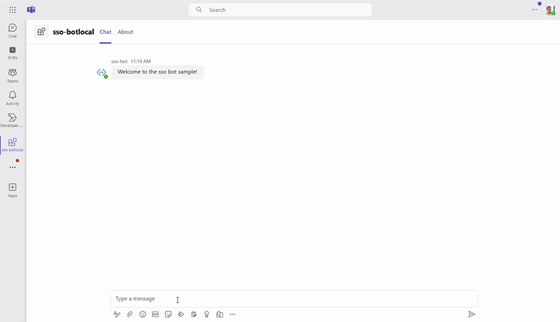

# Getting Started with Bot SSO

A bot, chatbot, or conversational bot is an app that responds to simple commands sent in chat and replies in meaningful ways. Examples of bots in everyday use include: bots that notify about build failures, bots that provide information about the weather or bus schedules, or provide travel information. A bot interaction can be a quick question and answer, or it can be a complex conversation. Being a cloud application, a bot can provide valuable and secure access to cloud services and corporate resources.

This is a sample chatbot application demonstrating Single Sign-on using `botbuilder` and Teams Framework that can respond to a `show` message.



## This sample illustrates

- Use Microsoft 365 Agents Toolkit to create a Teams bot app.
- Use Microsoft Graph to get User info and picture in Teams app.
- Use TeamsFx SDK to implementing SSO for Teams bot.

## Prerequisite to use this sample

- [Node.js](https://nodejs.org/), supported versions: 18, 20, 22
- A Microsoft 365 tenant in which you have permission to upload Teams apps. You can get a free Microsoft 365 developer tenant by joining the [Microsoft 365 developer program](https://developer.microsoft.com/en-us/microsoft-365/dev-program).
- [Microsoft 365 Agents Toolkit Visual Studio Code Extension](https://aka.ms/teams-toolkit) version 5.0.0 and higher or [Microsoft 365 Agents Toolkit CLI](https://aka.ms/teams-toolkit-cli)

> Note: If you are using node 20, you can add following snippet in package.json to remove the warning of incompatibility. (Related discussion: https://github.com/microsoft/botbuilder-js/issues/4550)

```
"overrides": {
  "@azure/msal-node": "^2.6.0"
}
```

## Minimal path to awesome

### Run the app locally

- From VS Code:
  1. hit `F5` to start debugging. Alternatively open the `Run and Debug Activity` Panel and select `Debug in Teams (Edge)` or `Debug in Teams (Chrome)`.
- From Microsoft 365 Agents Toolkit CLI:
  1.  Install [dev tunnel cli](https://aka.ms/teamsfx-install-dev-tunnel).
  1.  Login with your M365 Account using the command `devtunnel user login`.
  1.  Start your local tunnel service by running the command `devtunnel host -p 3978 --protocol http --allow-anonymous`.
  1.  In the `env/.env.local` file, fill in the values for `BOT_DOMAIN` and `BOT_ENDPOINT` with your dev tunnel URL.
      ```
      BOT_DOMAIN=sample-id-3978.devtunnels.ms
      BOT_ENDPOINT=https://sample-id-3978.devtunnels.ms
      ```
  1.  Run command: `atk provision --env local` .
  1.  Run command: `atk deploy --env local` .
  1.  Run command: `atk preview --env local` .

### Deploy the app to Azure

- From VS Code:
  1. Sign into Azure by clicking the `Sign in to Azure` under the `ACCOUNTS` section from sidebar.
  1. Click `Provision` from `LIFECYCLE` section or open the command palette and select: `Microsoft 365 Agents: Provision`.
  1. Click `Deploy` or open the command palette and select: `Microsoft 365 Agents: Deploy`.
- From Microsoft 365 Agents Toolkit CLI:
  1. Run command: `atk auth login azure`.
  1. Run command: `atk provision --env dev`.
  1. Run command: `atk deploy --env dev`.

### Preview the app in Teams

- From VS Code:
  1. Open the `Run and Debug Activity` Panel. Select `Launch Remote (Edge)` or `Launch Remote (Chrome)` from the launch configuration drop-down.
- From Microsoft 365 Agents Toolkit CLI:
  1. Run command: `atk preview --env dev`.

## Project Structure

```
src/
├── commands/          # Bot command handlers
├── telemetry/         # Telemetry and monitoring
│   ├── telemetryService.ts     # OpenTelemetry implementation
│   ├── saved_queries/          # Individual KQL files by category
│   │   ├── core/              # Essential bot metrics
│   │   ├── users/             # User analytics
│   │   ├── performance/       # Performance monitoring
│   │   ├── errors/            # Error analysis
│   │   ├── advanced/          # Business intelligence
│   │   ├── debugging/         # Data exploration
│   │   ├── publish-queries-to-insights.*  # Deployment scripts
│   │   └── README.md          # Query documentation
│   ├── index.ts               # Module exports
│   └── README.md              # Telemetry documentation
├── authConfig.ts      # Authentication configuration
├── config.ts          # Application configuration
├── index.ts           # Main application entry point
├── ssoDialog.ts       # SSO authentication dialog
└── teamsBot.ts        # Main bot implementation
```

## 📊 Monitoring and Telemetry

This bot includes comprehensive telemetry using **OpenTelemetry** and **Azure Application Insights** for production-ready monitoring.

### Features
- ✅ **Message Tracking**: Track all bot interactions and user messages
- ✅ **Performance Monitoring**: Response times, throughput, and bottlenecks
- ✅ **Error Analysis**: Detailed error tracking with context
- ✅ **User Analytics**: Active users, engagement patterns, and retention
- ✅ **SSO Flow Monitoring**: Authentication success/failure tracking
- ✅ **Custom Metrics**: Business-specific metrics and KPIs

### Configuration
Telemetry is configured via environment variables in `env/.env.dev`:

```bash
# Application Insights connection string (automatically configured)
APPLICATIONINSIGHTS_CONNECTION_STRING=InstrumentationKey=...;IngestionEndpoint=...

# Service identification
TELEMETRY_SERVICE_NAME=ai-calendar-assistant
TELEMETRY_SERVICE_VERSION=1.0.0
ENVIRONMENT=development
```

### Quick Start - Deploy Monitoring Queries
Deploy 30+ pre-built KQL queries to Application Insights:

```powershell
# Navigate to saved queries folder
cd src\telemetry\saved_queries

# Run automated deployment (uses your dev environment settings)
.\publish-queries-to-insights.bat
```

This will automatically:
- Load your Azure settings from `env\.env.dev`
- Find your Application Insights resource
- Deploy all monitoring queries with "TeamsBotTelemetry" category
- Provide direct portal links to access your dashboards

### Available Query Categories
- **Core Metrics** (8 queries): Message volume, response times, success rates, health dashboard
- **User Analytics** (5 queries): Active users, engagement patterns, user journeys
- **Performance** (5 queries): Response time analysis, bottlenecks, throughput
- **Error Analysis** (5 queries): Error categorization, failure tracking, recovery patterns
- **Advanced Analytics** (4 queries): Correlation analysis, anomaly detection, trends
- **Debugging** (6+ queries): Data exploration, validation, troubleshooting

### Accessing Your Data
After deployment, access your monitoring dashboards at:
- **Azure Portal**: Application Insights > Logs > Saved Queries > "TeamsBotTelemetry"
- **Direct Link**: Provided by the deployment script

For detailed documentation, see [`src/telemetry/README.md`](src/telemetry/README.md)

## Version History

| Date         | Author     | Comments                               |
| ------------ | ---------- | -------------------------------------- |
| Apr 19, 2022 | IvanJobs   | update to support Teams Toolkit v4.0.0 |
| Dec 7, 2022  | yukun-dong | update to support Teams Toolkit v5.0.0 |
| Feb 22, 2024 | yukun-dong | update card to adaptive card           |

## Feedback

We really appreciate your feedback! If you encounter any issue or error, please report issues to us following the [Supporting Guide](https://github.com/OfficeDev/TeamsFx-Samples/blob/dev/SUPPORT.md). Meanwhile you can make [recording](https://aka.ms/teamsfx-record) of your journey with our product, they really make the product better. Thank you!

test git